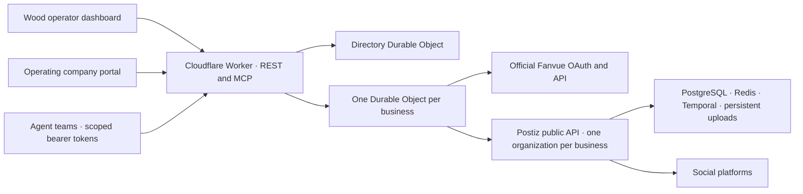

# Wood Enterprises content service

A shared content operation for Wood Enterprises and its operating companies, built in the Postiz fork. Companies supply their goals, brand guidance, and channels; Wood prepares the strategy, assigns the team, and launches the service. The company portal, operator dashboard, REST API, business-scoped MCP server, credentials, and publication queue run on Cloudflare Workers with SQLite-backed Durable Objects.

**Launch status:** the hub can be deployed independently. Real social publishing requires a reachable Postiz instance and its organization API keys; Fanvue requires an approved OAuth app and a connected creator. No businesses, accounts, agent jobs, or sample posts are seeded into production.

## What is implemented

- Company onboarding in four saveable steps: business and measurable goals, audience and brand, channels, and the review policy.
- Separate company access links, scoped to one company, with expiry and revocation. Company representatives can revise their brief, authorize connections, approve strategy/posts according to policy, view results, and pause publishing.
- Wood portfolio with service status, operating team, and next review date. Launch checks require a submitted brief, all requested accounts connected, an active matching strategy, required company approval, and publisher access.
- Separate business profiles, voice, audience, goals, timezone, publishing policy, and daily scheduling limits.
- Versioned content strategies: objectives, pillars, channel cadence, guardrails, and measures of success. An owner activates each version.
- Revisioned drafts, policy-specific approval, durable scheduling, cancellation, publication receipts, outcome reconciliation, audit history, and measured strategy reviews.
- Fanvue OAuth with PKCE, refresh token rotation, direct publishing, multipart media upload tools, media readiness checks, post retrieval, and account-level metrics.
- Postiz organization connections for its existing social providers, post submission, post status retrieval, and channel analytics.
- Expiring, revocable reader/editor/publisher tokens scoped to one business; Streamable HTTP MCP at `/mcp/{business-id}`.
- A responsive portal for company representatives, Wood operators, and agents with matching permissions.

Fanvue is implemented in this Worker hub. It does **not** add a Fanvue tile to the original Postiz calendar UI. Social posts submitted through Postiz appear in Postiz; direct Fanvue posts appear in Fanvue and this hub.

## Architecture



The existing Postiz application requires long-running services and persistent databases. This fork keeps those services separate and puts the new business control layer on Workers. The hub uses the public Postiz API; it does not import the NestJS server into a Worker. The upstream frontend, orchestration workflows, Prisma schema, and provider implementations are untouched.

## Local development

Use Node 22+ and pnpm. This folder is an independent workspace with its own lockfile, so the entire upstream dependency tree is unnecessary for hub development.

```sh
cd apps/business-hub
pnpm install --frozen-lockfile
pnpm setup:secrets
pnpm dev --port 8787
```

Open `http://localhost:8787` and use `HUB_ADMIN_TOKEN` from the ignored `.dev.vars` file. The setup command refuses to overwrite existing secrets. Add optional `POSTIZ_ORIGIN`, `FANVUE_CLIENT_ID`, and `FANVUE_CLIENT_SECRET` when testing real providers. Fanvue may require a registered HTTPS callback; use the deployed hub for that flow if localhost is not approved.

```sh
pnpm typecheck
pnpm test
pnpm build
```

Tests use real workerd/Durable Objects through Miniflare and a real MCP client. Provider traffic is mocked; tests never publish to real accounts. Coverage includes cross-business isolation, company/operator boundaries, onboarding revisions, launch requirements, company approval, service pauses, unchanged-brief preservation, portfolio synchronization, Origin and input validation, idempotency, durable alarms, ambiguous outcomes, 429 retries, OAuth replay, token refresh, media ownership, automatic publishing policy, and revocation. `pnpm build` is a Wrangler deployment dry run.

## Deployment and onboarding

See [DEPLOYMENT.md](DEPLOYMENT.md) for Worker secrets, Fanvue app setup, and a persistent Postiz deployment recipe. See [AGENT_GUIDE.md](AGENT_GUIDE.md) for the business onboarding order, MCP tools, and agent operating loop. The latter is an operating guide for this application, not authorization to run publication on an unconfigured business.

## Operational boundaries

- Wood currently uses one global operator credential. Company and agent credentials are scoped to one business. Company links are reusable bearer links until expiry or revocation, not email-verified accounts or single-use invitations. Share them through a trusted channel. Public registration, staff accounts/SSO, billing, and email delivery are not implemented.
- Credentials are encrypted at rest with AES-GCM and business/provider associated data. Agent tokens are stored as hashes. The owner token and encryption key are Cloudflare secrets. Back up the encryption key securely; replacing it without migration makes existing provider credentials unreadable.
- New companies use the managed service workflow. The default policy requires company strategy approval and lets Wood manage publication after launch. Alternatives require company approval of every post or delegate both strategy and publishing to Wood. Company approval is tied to the exact brief/strategy version and cannot be recorded with the Wood operator credential.
- Publishing is checked both at scheduling and at delivery. A pause, changed brief, or strategy revision holds publication until Wood launches the current mandate again. Posts that become due while held are marked failed for review; resuming does not republish these automatically. A provider request already in progress or a post already accepted by Postiz cannot be recalled by pausing the hub.
- Existing businesses without the new managed-service flag retain the earlier workflow and approval settings. Reviewing/saving an unchanged brief preserves the service state and approvals.
- Channel membership, strategy version, revision, approval, and daily reservations are enforced. Pillar wording, brand voice, guardrails, and weekly cadence are instructions for people/agents, not semantic policy filters or hard weekly quotas.
- Daily limits count scheduling reservations in the business timezone. Cancelling or failing a post does not refund its reservation. A business can have at most 1,000 pending posts.
- A remote publication cannot be transacted atomically with Durable Object storage. Ambiguous responses and interrupted publications are held as `uncertain`, never blindly retried. The owner verifies the destination and reconciles. An explicit 429 is retried at most four times after the initial attempt.
- Postiz acceptance is `submitted`, not proof of publication. Agents can inspect `postiz_posts` or the native Postiz UI for final outcomes. The hub does not yet synchronize every subsequent Postiz delivery status automatically.
- There is no built-in LLM runner or autonomous agent scheduler. Your existing agent runtime connects to MCP and drives the strategy loop. No autonomous team has been started by deploying the hub.
- Fanvue uploads are available through REST/MCP; the dashboard accepts vault media UUIDs. Postiz media must already be uploaded to Postiz and use its provider-specific settings.
- This release does not include webhooks, a shared R2 asset library, automated credential backup/export, or a full upstream Postiz build verification. The supplied persistent-host recipe must be validated on its target host.

License: AGPL-3.0, inherited from Postiz. The dashboard links to this fork’s source. Deploy corresponding source changes to the fork whenever releasing a modified hub.
